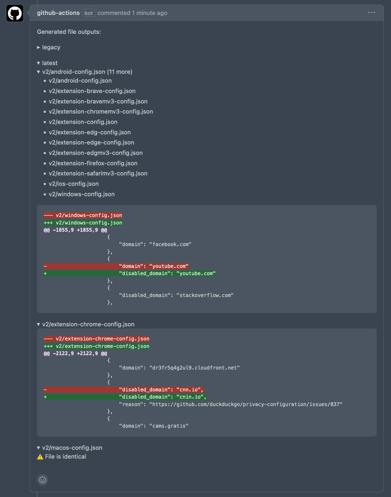

# Config Reviewer Documentation

As a config reviewer, your role is critical in preventing misconfiguration of our platform whilst allowing us to respond to breakage promptly.

## Guidance

- Ensure the PR is up to date with the main branch.
- Wait for automation to complete before merging changes.
- If you're unfamiliar with the keys being edited, ask the feature author to clarify.
- Clarify with the author if a change shouldn't target a certain platform.
- If the PR has set 'merge when ready', then let it merge once you've approved it. (If this status is not present, ping the author on MM/Asana to let them know, but allow them to merge the PR in case they're waiting on further review.)
- Please ask questions in ~breakage if you're unsure!
- Once a PR is merged it will be automatically released to all platforms; generally it will be adopted within 30 minutes.

## PR Diff Automation

- GitHub automation aggregates all the changes so it's easy to see when files differ.
- The config is bundled such that the generated output doesn't always match exactly what was entered into the files.
- This tool illustrates what will be sent to the client applications.
- The automation ignores things like version or hash strings that are irrelevant to a reviewer on the functional changes being made.
- 👀 Take care in ensuring the correct platforms have been altered.
- Some configuration options merge in unique ways with their relevant overrides files.

---

## See Also

- [Feature Implementer Documentation](./feature-implementer-documentation.md)
- [Config Maintainer Documentation](./config-maintainer-documentation.md)
- [Privacy Feature Key Mappings](./privacy-feature-key-mappings.md)
- [🛠 Implementation Guidelines: Remote Privacy Configuration/Allowlists](./implementation-guidelines-remote-privacy-configuration-allowlists.md)
- [Incremental Rollout Implementation Guide](./incremental-rollout-implementation-guide.md)
- [Writing a Schema for Your Config Feature](./writing-schema-for-config-feature.md)
- [Remote Configuration Change Log](./remote-configuration-change-log.md)
